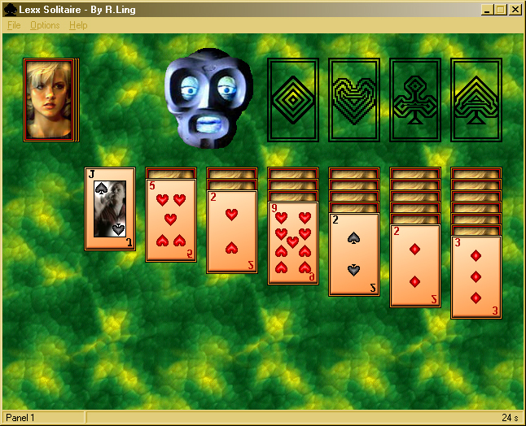



## Lexx Solitaire

### Description

Shows how to make a card game in VB, with API calls only. No card dlls. Customizable background, card designs & multilingual menu captions. You'll probably get bored of the game pretty fast, but it might teach you some graphical techniques. I'll try to come up with a new and even better version as soon as possible. In the meantime, keep voting for it!!!
 
### More Info
 
To make it work properly, you'll have to unzip the contents of the file to some directory.

             |
---                |---
**Submitted On**   |2000-12-02 01:34:26
**By**             |[Erling Andersen](https://github.com/Planet-Source-Code/PSCIndex/blob/master/ByAuthor/erling-andersen.md)
**Level**          |Advanced
**User Rating**    |4.6 (190 globes from 41 users)
**Compatibility**  |VB 5\.0, VB 6\.0
**Category**       |[Games](https://github.com/Planet-Source-Code/PSCIndex/blob/master/ByCategory/games__1-38.md)
**World**          |[Visual Basic](https://github.com/Planet-Source-Code/PSCIndex/blob/master/ByWorld/visual-basic.md)
**Archive File**   |[CODE\_UPLOAD122561222000\.zip](https://github.com/Planet-Source-Code/erling-andersen-lexx-solitaire__1-13251/archive/master.zip)

